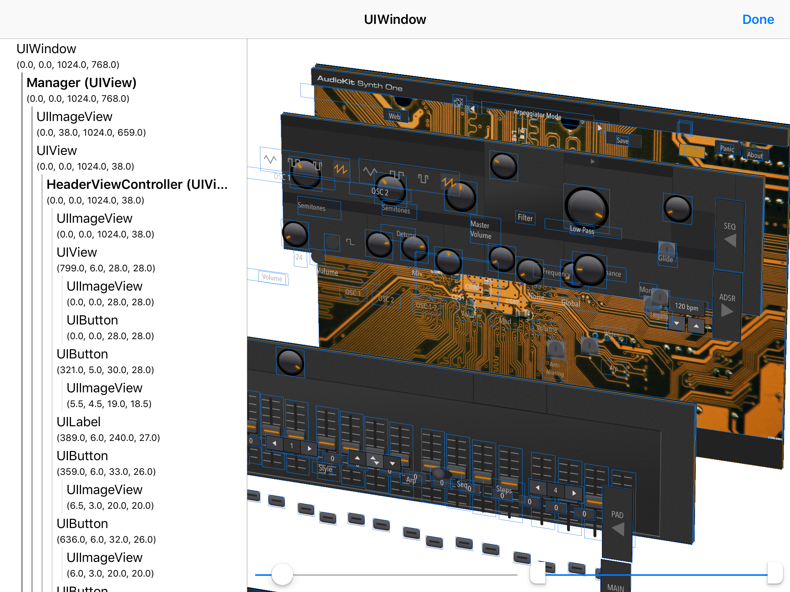
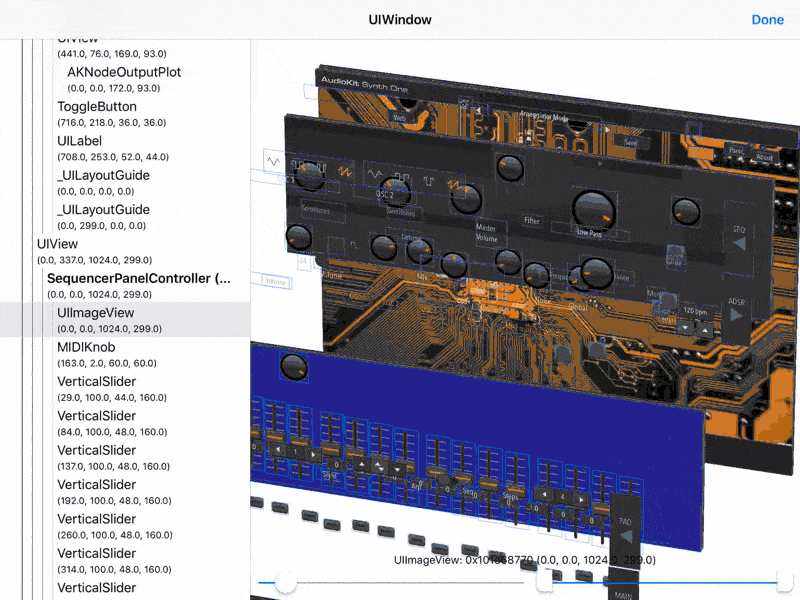
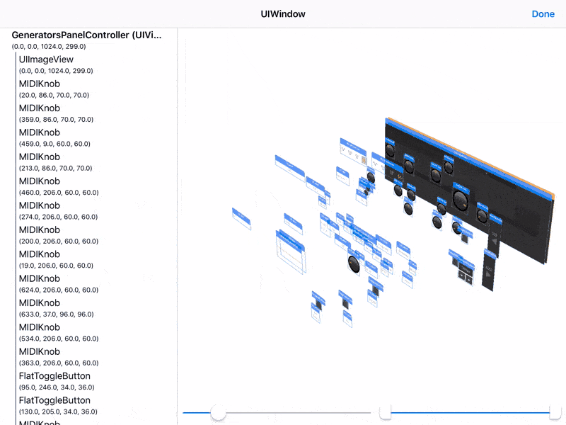
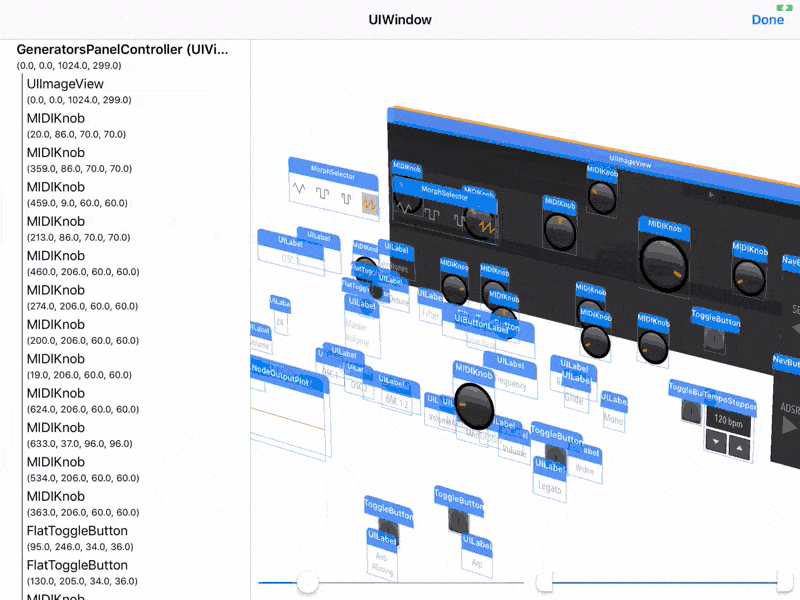

# InAppViewDebugger

[](LICENSE)
[](https://cocoapods.org/?q=InAppViewDebugger)
[](https://github.com/Carthage/Carthage)

<p align="center">

</p>

`InAppViewDebugger` is a library that implements a view debugger with a 3D snapshot view and a hierarchy view, similar to [Reveal](https://revealapp.com) and [Xcode's own view debugger](https://developer.apple.com/library/archive/documentation/ToolsLanguages/Conceptual/Xcode_Overview/ExaminingtheViewHierarchy.html). The key distinction is, as the project title suggests, that this can be embedded inside the app and used on-device to debug UI issues without needing to be tethered to a computer.

## Features

* **3D snapshot view implemented in SceneKit**: Gesture controls for zooming, panning, and rotating.
* **Hierarchy (tree) view that synchronizes its selection with the 3D view**: This is a feature I really wanted in Xcode, to be able to visually find a view and see where it is in the hierarchy view
* **Support for [iPad](images/main.png) and [iPhone](images/iphone1.png)**: Layouts are designed specifically for each form factor.
* **Extensible:** The base implementation supports `UIView` hierarchies, but this is easily extensible to support any kind of UI framework (e.g. CoreAnimation or SpriteKit)

## Requirements

* iOS 11.0+
* Xcode 10.1+ (framework built for Swift 4.2)

## Installation

### CocoaPods

Add the following line to your `Podfile`:

```
pod 'InAppViewDebugger', '~> 1.0.0'
```

### Carthage

Add the following line to your `Cartfile`:

```
github "indragiek/InAppViewDebugger" "1.0.0"
```

## Usage

### Swift

```swift
import InAppViewDebugger

@IBAction func showViewDebugger(sender: AnyObject) {
  InAppViewDebugger.present()
}
```

### Objective-C

```objc
@import InAppViewDebugger;

// alternative import (they're the same): 
// #import <InAppViewDebugger/InAppViewDebugger-Swift.h>

- (IBAction)showViewDebugger:(id)sender {
  [InAppViewDebugger present];
}
```

### `lldb`

```
(lldb) expr -lswift -- import InAppViewDebugger
(lldb) expr -lswift -- InAppViewDebugger.present()
```

The `present` function shows the UI hierarchy for your application's key window, presented over the top view controller of the window's root view controller. There are several other methods available on `InAppViewDebugger` for presenting a view debugger for a given window, view, or view controller.

## Controls

### Focusing on an Element

To focus on the subhierarchy of a particular element, **long press on the element** to bring up the action menu and tap "Focus". The long press can be used both in the hierarchy view and the 3D snapshot view. The "Log Description" action will log the description of the element to the console, so that if you're attached to Xcode you can copy the address of the object for further debugging.

<p align="center">

</p>

### Adjusting Distance Between Levels

The slider on the bottom left of the snapshot view can be used to adjust the spacing between levels of the hierarchy:

<p align="center">

</p>

### Adjusting Visible Levels

The range slider on the bottom right of the snapshot view can be used to adjust the range of levels in the hierarchy that are visible:

<p align="center">

</p>

### Showing/Hiding Headers

Each UI element has a header above it that shows its class name. These headers can be hidden or shown by **long pressing on an empty area of the snapshot view** to bring up the action menu:

<p align="center">

</p>

### Showing/Hiding Borders

Similarly to the headers, the borders drawn around each element can also be shown or hidden:

<p align="center">

</p>

## Customization

Colors, fonts, and other attributes for both the snapshot view and the hierarchy view can be changed by creating a custom [`Configuration`](blob/master/InAppViewDebugger/Configuration.swift). The configuration is then passed to a function like `InAppViewDebugger.presentForWindow(:configuration:completion:)`.

## Extending for Other UI Frameworks

The current implementation only supports `UIView` hierarchies, but this can easily be extended to support other UI frameworks by conforming to the [`Element`](blob/master/InAppViewDebugger/Element.swift) protocol. See [`ViewElement`](blob/master/InAppViewDebugger/ViewElement.swift) to see what an example implementation looks like — by providing a the frame, a snapshot image, and a few other pieces of information, all of the features described above will work for your own framework.

A [`Snapshot`](blob/master/InAppViewDebugger/Snapshot.swift) instance represents a recursive snapshot of the *current state* of a UI element hierarchy, and is constructed using an `Element`. The snapshot can then be passed to `InAppViewDebugger.presentWithSnapshot(:rootViewController:configuration:completion:` to show the view debugger.

## Credits

* [Kyle Van Essen](https://twitter.com/kyleve) for [this tweet](https://twitter.com/kyleve/status/1111689823759171585) picturing Square's implementation that inspired me to build this
* [AudioKit SynthOne](https://github.com/AudioKit/AudioKitSynthOne), an amazing open-source audio synthesizer app for the iPad that made for a great demo as pictured above

## Contact

* Indragie Karunaratne
* [@indragie](http://twitter.com/indragie)
* [http://indragie.com](http://indragie.com)

## License

`InAppViewDebugger` is licensed under the MIT License. See `LICENSE` for more information.

